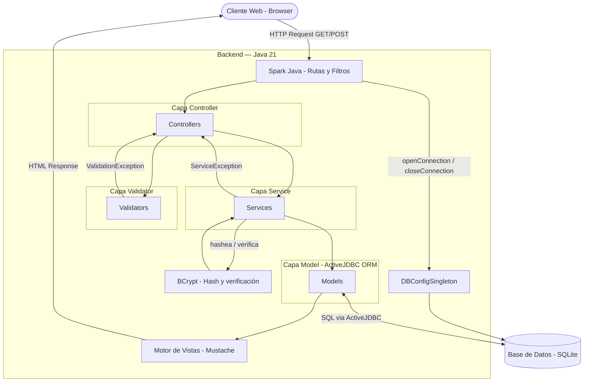

```mermaid
flowchart TD
    CW(["Cliente Web - Browser"])

    subgraph Backend ["Backend — Java 21"]

        SJ["Spark Java - Rutas y Filtros"]
        BC["BCrypt - Hash y verificación"]

        subgraph Controllers ["Capa Controller"]
            C["Controllers"]
        end

        subgraph Validators ["Capa Validator"]
            V["Validators"]
        end

        subgraph Services ["Capa Service"]
            S["Services"]
        end

        subgraph Models ["Capa Model - ActiveJDBC ORM"]
            M["Models"]
        end

        MV["Motor de Vistas - Mustache"]
        CFG["DBConfigSingleton"]
    end

    DB[("Base de Datos - SQLite")]

    CW -- "HTTP Request GET/POST" --> SJ
    SJ --> C
    C --> V
    V -- "ValidationException" --> C
    C --> S
    S -- "hashea / verifica" --> BC
    BC --> S
    S -- "ServiceException" --> C
    S --> M
    M --> MV
    MV -- "HTML Response" --> CW
    SJ -- "openConnection / closeConnection" --> CFG
    CFG --> DB
    M <-- "SQL via ActiveJDBC" --> DB
```
